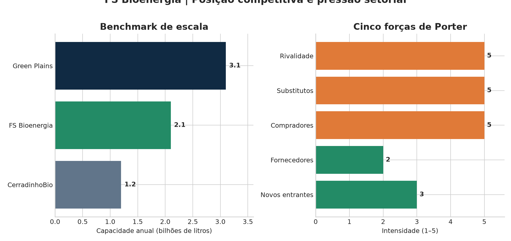
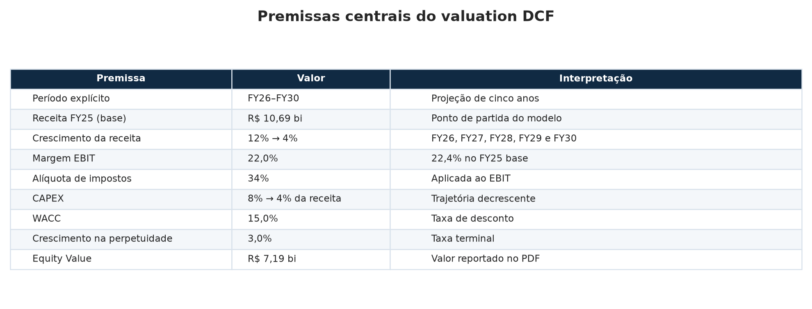
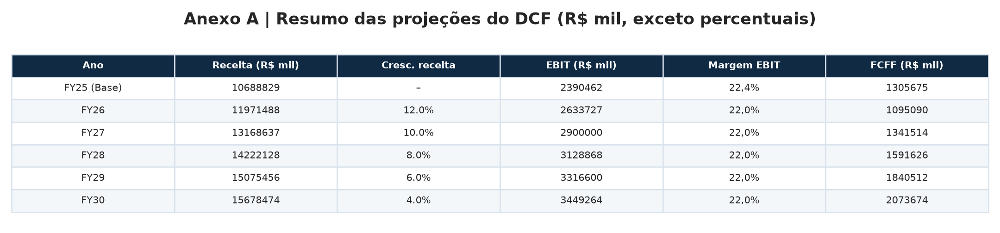
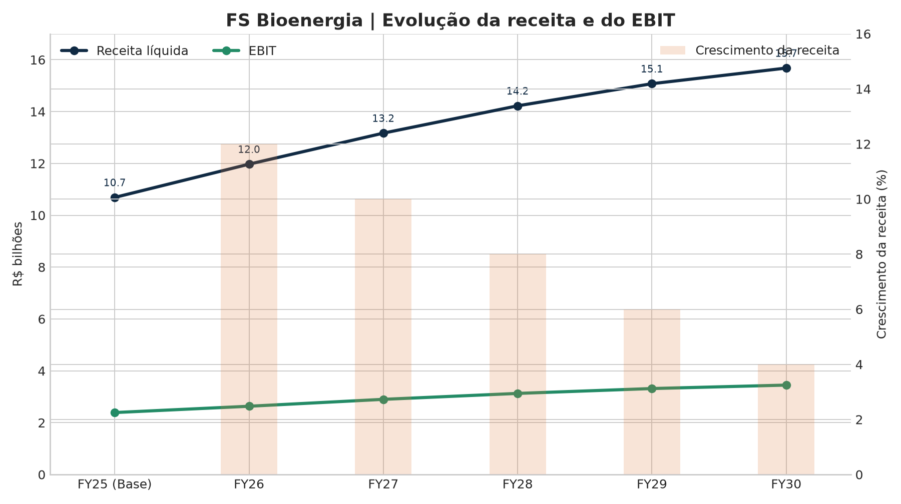
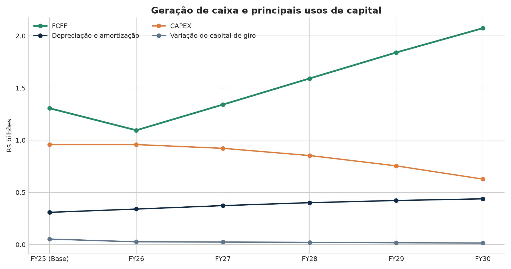
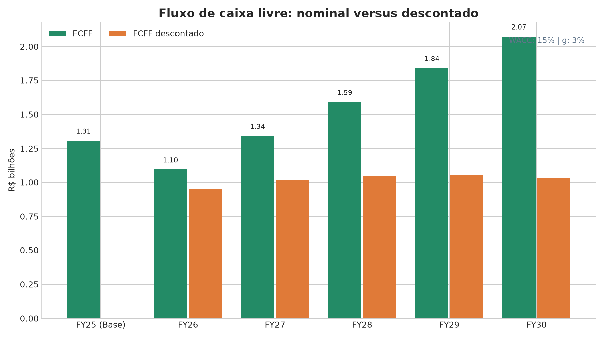
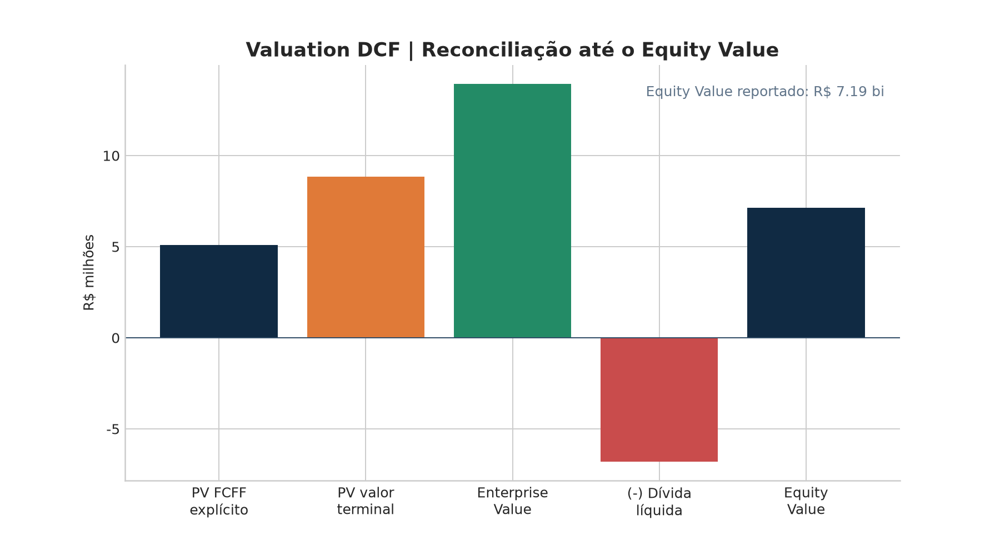
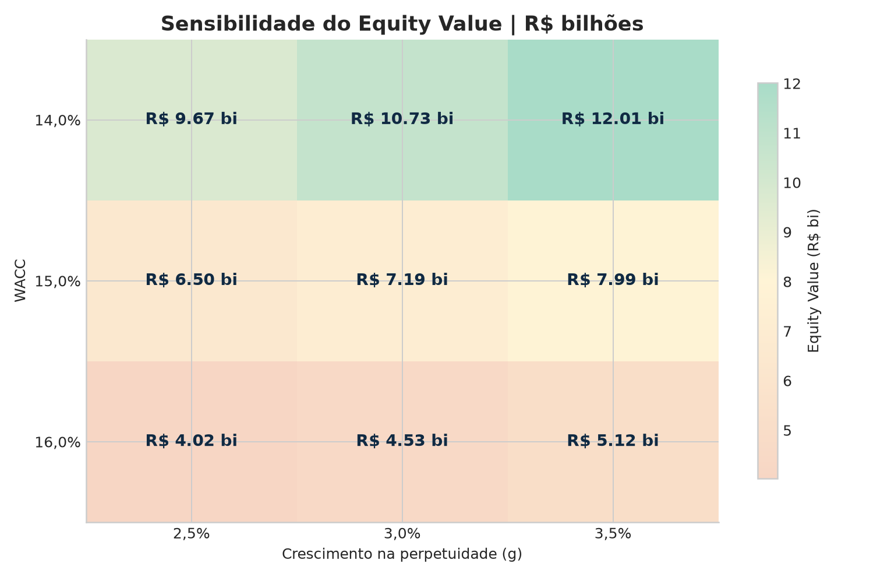
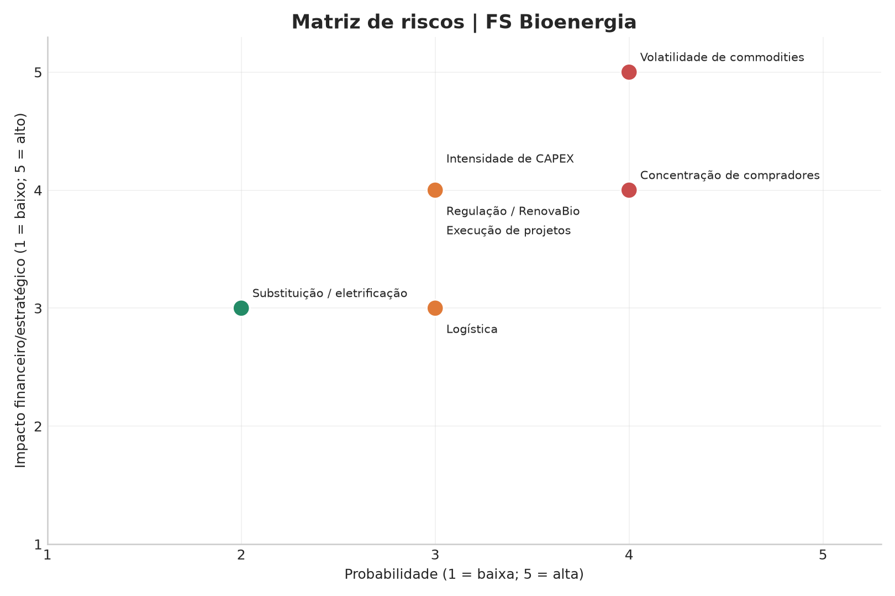

# FS Bioenergia — Valuation DCF e análise setorial

Este projeto apresenta uma análise acadêmica e de portfólio da **FS Bioenergia**, produtora brasileira de etanol de milho, estruturada como um memorando de investimento. O trabalho combina análise estratégica, benchmarking competitivo, análise setorial, premissas financeiras e um modelo de **Fluxo de Caixa Descontado (DCF)**. Todos os gráficos e tabelas desta versão são gerados programaticamente com **Python, Pandas e Matplotlib** a partir dos dados transcritos do PDF disponibilizado no repositório.

> **Aviso:** este material foi elaborado para fins acadêmicos e de portfólio. Não constitui recomendação de investimento, oferta ou aconselhamento financeiro.

## Sumário executivo

A FS Bioenergia opera três unidades industriais em Mato Grosso, com capacidade superior a **2,1 bilhões de litros por ano**. Seu modelo de biorrefinaria integrada produz etanol anidro e hidratado, DDG para alimentação animal, óleo de milho, energia cogerada e créditos de descarbonização (CBIOs). A localização próxima ao milho safrinha e ao mercado de pecuária é apresentada no estudo como uma vantagem operacional e logística.

O modelo DCF utiliza projeções de FY26 a FY30, partindo de uma receita base de **R$ 10,69 bilhões** no FY25. As premissas centrais são crescimento de receita desacelerando de **12% para 4%**, margem EBIT de aproximadamente **22%**, CAPEX reduzindo de **8% para 4% da receita**, **WACC de 15%** e crescimento na perpetuidade de **3%**. O Equity Value reportado no resumo do PDF é de **R$ 7,19 bilhões**; no Anexo A, a soma detalhada resulta em **R$ 7,143 bilhões**, diferença de arredondamento e/ou consistência entre as partes do documento.

## Estrutura do projeto

| Caminho | Conteúdo |
|---|---|
| `scripts/generate_visuals.py` | Script reprodutível que gera gráficos, tabelas e CSVs |
| `assets/charts/` | PNGs e bases tabulares usadas no portfólio |
| `Grupo GHT4 Challenge Commodities (3).pdf` | PDF de contexto original |
| `Grupo GHT4 Challenge Commodities (3).txt` | Texto extraído do PDF para auditoria |

Para reproduzir todos os resultados, execute:

```bash
python3 scripts/generate_visuals.py
```

## Perfil da companhia e modelo de negócios

A empresa foi descrita no estudo como uma joint venture criada em 2016 entre a Tapajós Participações, do Brasil, e a Summit Agricultural Group, dos Estados Unidos. O modelo integrado reduz a dependência de uma única linha de receita ao combinar biocombustíveis, nutrição animal, óleo, energia e créditos ambientais.

| Produto ou atividade | Papel econômico no modelo |
|---|---|
| Etanol anidro e hidratado | Principal produto energético e exposição à paridade com a gasolina |
| DDG | Coproduto para alimentação animal, com potencial de exportação para a China |
| Óleo de milho | Coproduto beneficiado pela demanda de óleos vegetais e pelo mandato de biodiesel |
| Energia elétrica | Cogerada e potencialmente monetizada como receita complementar |
| CBIOs | Créditos de descarbonização associados à eficiência energético-ambiental |

A logística é multimodal, utilizando rodovias, ferrovias e portos, incluindo os corredores Norte-Sul, Rumo, Santos, Paranaguá e Itaqui, conforme o PDF de referência.

## Mercado, regulação e drivers

O estudo caracteriza o etanol de milho como um vetor estrutural de crescimento da bioenergia brasileira. O milho permite operação industrial contínua durante o ano, reduzindo a sazonalidade em relação à cana. O PDF informa produção nacional de **32,5 bilhões de litros em 2023**, dos quais **7 bilhões de litros** seriam provenientes do milho, e aponta participação de aproximadamente **20%** do milho na produção nacional, com potencial de atingir **40% até 2030**.

Os principais drivers de preço identificados são a paridade entre etanol e gasolina, o preço do milho, o câmbio, o clima, os mandatos de mistura e a demanda por coprodutos. A Lei nº 14.993/2024, denominada “Combustível do Futuro”, é apresentada no material como suporte regulatório para etanol, SAF, diesel verde e biometano. O PDF também registra o preço do CBIO em torno de **R$ 69,42 no primeiro semestre de 2025**, após picos acima de R$ 100 em 2024.

## Benchmarking competitivo e análise de Porter

O estudo compara a capacidade anual da FS com a CerradinhoBio e a Green Plains. Os valores são indicativos e foram transcritos do PDF.



A avaliação de Porter atribui maior intensidade ao poder dos compradores, à ameaça de substitutos e à rivalidade competitiva. Isso reflete um setor de commodities no qual escala, eficiência industrial, acesso à matéria-prima e logística são determinantes.

## Premissas do valuation

| Premissa | Valor adotado | Interpretação |
|---|---:|---|
| Período explícito | FY26–FY30 | Cinco anos de projeção |
| Receita FY25 | R$ 10,69 bi | Base do modelo |
| Crescimento da receita | 12%, 10%, 8%, 6%, 4% | Desaceleração gradual entre FY26 e FY30 |
| Margem EBIT | 22,0% | 22,4% no FY25 base |
| Alíquota de impostos | 34% | Aplicada ao EBIT |
| CAPEX | 8% → 4% da receita | Redução gradual da intensidade de capital |
| WACC | 15,0% | Taxa de desconto dos fluxos |
| Crescimento na perpetuidade | 3,0% | Taxa terminal |
| Equity Value reportado | R$ 7,19 bi | Valor arredondado apresentado no resumo |



## Projeções financeiras completas

Os valores abaixo estão em **milhares de reais**, exceto quando indicado. A tabela contempla receita, crescimento, EBIT, impostos, NOPAT, depreciação e amortização, CAPEX, capital de giro, FCFF, fator de desconto e FCFF descontado.



A base completa também está disponível em [`projecoes_dcf_completas.csv`](assets/charts/projecoes_dcf_completas.csv). As principais relações de modelagem são:

```text
NOPAT = EBIT × (1 – alíquota de impostos)
FCFF = NOPAT + D&A – CAPEX – variação do capital de giro
Valor terminal = FCFF do último ano × (1 + g) / (WACC – g)
Enterprise Value = PV dos FCFF explícitos + PV do valor terminal
Equity Value = Enterprise Value – dívida líquida
```



A projeção mostra crescimento da receita de R$ 11,97 bilhões em FY26 para R$ 15,68 bilhões em FY30. O EBIT evolui de R$ 2,63 bilhões para R$ 3,45 bilhões, enquanto a margem permanece próxima de 22% conforme a premissa do modelo.





## Valuation DCF

O valuation detalhado do Anexo A é composto pelos seguintes itens:

| Item | Valor (R$ mil) |
|---|---:|
| Soma dos FCFF descontados de FY26 a FY30 | 5.097.562 |
| FCFF na perpetuidade | 2.135.884 |
| Valor terminal | 17.799.035 |
| Valor terminal descontado | 8.846.120 |
| Enterprise Value | 13.943.682 |
| Dívida líquida implícita na reconciliação | 6.800.491 |
| Equity Value detalhado | 7.143.191 |
| Equity Value arredondado no resumo | 7,19 bilhões |



O gráfico de reconciliação evidencia que uma parcela relevante do Enterprise Value vem do valor terminal. Por isso, o resultado é especialmente sensível ao WACC, ao crescimento na perpetuidade e à capacidade de converter crescimento operacional em FCFF.

## Análise de sensibilidade

| WACC \\ g | 2,5% | 3,0% | 3,5% |
|---|---:|---:|---:|
| 14,0% | R$ 9,67 bi | R$ 10,73 bi | R$ 12,01 bi |
| 15,0% | R$ 6,50 bi | R$ 7,19 bi | R$ 7,99 bi |
| 16,0% | R$ 4,02 bi | R$ 4,53 bi | R$ 5,12 bi |



No cenário-base de WACC de 15% e crescimento terminal de 3%, o Equity Value é de R$ 7,19 bilhões. A faixa apresentada vai de R$ 4,02 bilhões, no cenário de WACC de 16% e g de 2,5%, a R$ 12,01 bilhões, no cenário de WACC de 14% e g de 3,5%. Essa amplitude reforça a necessidade de interpretar o DCF como uma distribuição de cenários, e não como um único ponto de precisão.

## Riscos e pontos de atenção

Os riscos abaixo foram organizados com uma escala qualitativa de probabilidade e impacto baseada na discussão do PDF. As notas são uma ferramenta de comunicação do portfólio, não uma estimativa estatística.

| Risco | Mecanismo de impacto |
|---|---|
| Volatilidade de commodities | Alterações no preço do milho, etanol, gasolina e DDG comprimem o crush spread e o FCFF |
| Regulação e RenovaBio | Mudanças em mandatos, metas de descarbonização ou preço dos CBIOs afetam receita e previsibilidade |
| Intensidade de CAPEX | Expansões exigem capital elevado e podem pressionar alavancagem e retorno sobre o capital |
| Execução de projetos | Atrasos, custos acima do orçamento ou ramp-up abaixo do esperado reduzem o valor presente |
| Concentração de compradores | Grandes distribuidoras possuem poder de barganha e podem pressionar preços |
| Logística | Distâncias, fretes, disponibilidade ferroviária e acesso a portos afetam custos e exportações |
| Substituição tecnológica | Gasolina, farelo de soja, outros óleos vegetais e eletrificação competem com produtos do grupo |



As principais oportunidades que podem compensar parte desses riscos são a expansão de capacidade, ganhos de eficiência operacional, valorização do DDG com a abertura do mercado chinês, monetização de CBIOs, uso do etanol na rota Alcohol-to-Jet (SAF) e eventual desalavancagem estratégica.

## Dados e reprodutibilidade

Os arquivos CSV na pasta `assets/charts/` permitem auditar as entradas sem depender da leitura das imagens. O script centraliza os dados do Anexo A, a matriz de sensibilidade, as premissas, o benchmarking, as forças de Porter e os riscos. Para atualizar o portfólio com novas premissas, basta alterar as séries na seção inicial do script e executar novamente o comando de geração.

## Referência principal

O contexto, os dados e as premissas deste portfólio foram transcritos do documento [`Grupo GHT4 Challenge Commodities (3).pdf`](Grupo%20GHT4%20Challenge%20Commodities%20(3).pdf), disponível neste repositório. O PDF também lista as fontes públicas utilizadas no trabalho original, incluindo FS, ANP, B3, UNEM, Green Plains, Senado Federal e Portal Gov.br.

## Sensibilidade avançada

Além da matriz-base de três por três cenários, o projeto agora calcula uma matriz paramétrica configurável de **WACC × crescimento perpétuo**. Por padrão, a grade cobre WACC de 10% a 20% e crescimento perpétuo de 1% a 5%, com incrementos de 0,5%. Cada célula recalcula o PV dos FCFF explícitos, o valor terminal, o Enterprise Value e o Equity Value, apresentado em R$ bilhões.

A matriz completa é gerada por `scripts/valuation_model.py` e exportada para [`sensibilidade_avancada.csv`](assets/charts/sensibilidade_avancada.csv). O modelo bloqueia combinações economicamente inválidas em que o WACC é menor ou igual ao crescimento na perpetuidade.

## Dashboard interativo em Streamlit

O dashboard permite alterar o WACC, o crescimento perpétuo, as faixas da matriz e o incremento da grade. A interface apresenta KPIs do valuation, heatmap interativo, cenários conservador/base/otimista, download da matriz CSV, projeções financeiras, gráfico interativo de Receita/EBIT/FCFF e os gráficos PNG do portfólio.

Para executar localmente:

```bash
pip install -r requirements.txt
streamlit run app.py
```

Em seguida, abra `http://localhost:8501` no navegador. O aplicativo está concentrado em [`app.py`](app.py), enquanto a lógica do modelo fica em [`scripts/valuation_model.py`](scripts/valuation_model.py), permitindo separar apresentação e cálculo.

## Licença e uso

Este repositório é apresentado como material de estudo e portfólio. Os valores, premissas e conclusões devem ser revisados antes de qualquer utilização profissional ou decisão financeira.
